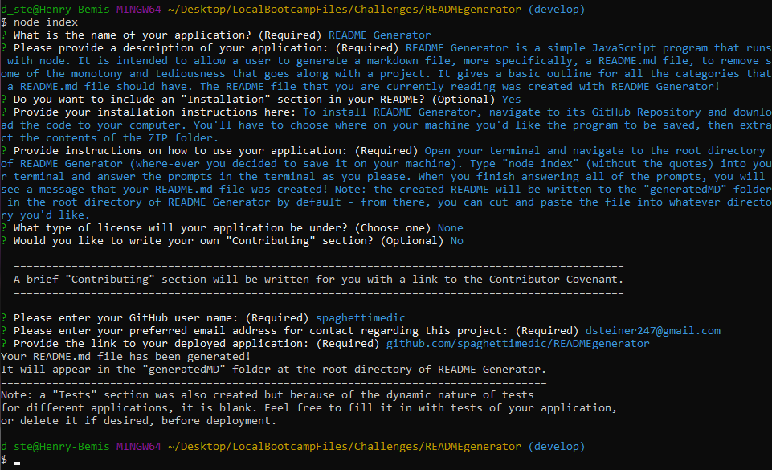

# README Generator 

## Description
README Generator is a simple JavaScript program that runs with node. It is intended to allow a user to generate a markdown file, more specifically, a README.md file, to remove some of the monotony and tediousness that goes along with a project. It gives a basic outline for all the categories that a README.md file should have. The README file that you are currently reading was created with README Generator!

## Table of Contents
* [Installation](#installation)
* [Usage](#usage)
* [Contributing](#contributing)
* [Tests](#tests)
* [Questions](#questions)
* [Deployed Application](#deployed-application)

## Installation
To install README Generator, navigate to its [GitHub Repository](https://www.github.com/spaghettimedic/READMEgenerator) and download the code to your computer. You'll have to choose where on your machine you'd like the program to be saved, then extract the contents of the ZIP folder.

## Usage
Open your terminal and navigate to the root directory of README Generator (where-ever you decided to save it on your machine). Type "node index" (without the quotes) into your terminal and answer the prompts in the terminal as you please. When you finish answering all of the prompts, you will see a message that your README.md file was created! Note: the created README will be written to the "generatedMD" folder in the root directory of README Generator by default - from there, you can cut and paste the file into whatever directory you'd like. Below is a screenshot depicting what the command line will look like when running README Generator:

## Contributing
This is an open source project and as such, please follow the [Contributor Covenant](https://www.contributor-covenant.org/).

## Questions
Check out my GitHub profile [here!](https://www.github.com/spaghettimedic) I can be reached directly at dsteiner247@gmail.com should you have any questions.

## Deployed Application
Find the code repository on my GitHub account at https://www.github.com/spaghettimedic/READMEgenerator. You can reference the [installation](#installation) and [usage](#usage) sections of this README for instructions on how to use README Generator.